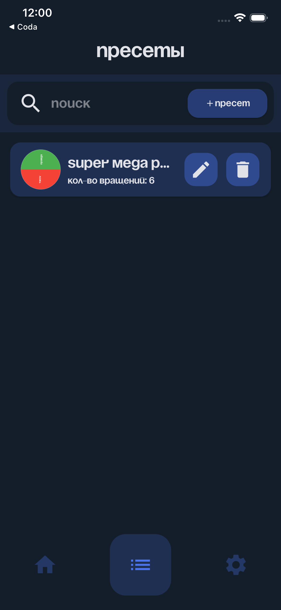
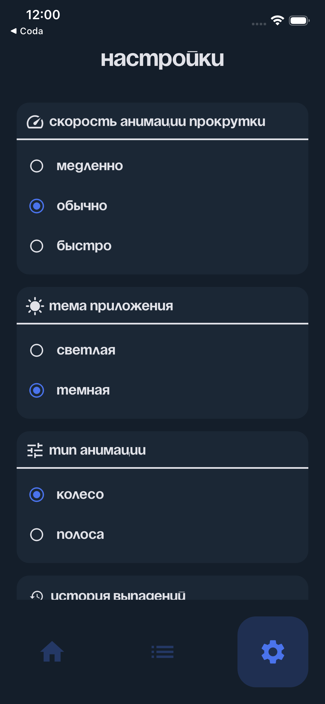

<div align="center">
  <h1>RNDMs</h1>
  <p><b>Интерактивный рандомайзер для выбора, решений и игр</b></p>
  <p><i>Interactive randomizer for selections, decisions and chance-driven interactions</i></p>
</div>

<div align="center">

[](https://flutter.dev)
[](https://dart.dev)
[](https://resocoder.com/flutter-clean-architecture)
[](#)

</div>

<hr>

## О проекте

<b>RNDMs</b> — современное приложение-рандомайзер, предназначенное для генерации случайных результатов через визуальные и интерактивные механики.

Приложение помогает принимать решения, выбирать случайные элементы и создавать игровые сценарии, где результат определяется вероятностью.

Основные сценарии использования:

- случайный выбор из списка  
- колесо фортуны  
- генерация случайных результатов  
- игры и развлекательные механики  
- принятие решений  

Главная идея RNDMs — сделать взаимодействие со случайностью **визуальным, быстрым и интуитивным**.

Пользователь может задать список элементов, настроить параметры и запустить механизм случайного выбора, получая результат с наглядной анимацией.

**Ключевые принципы приложения:**

- минималистичный интерфейс  
- высокая скорость работы  
- визуальная наглядность результата  
- гибкость настройки  

---

## About the Project

<b>RNDMs</b> is a modern randomizer application designed to generate outcomes through interactive and visual randomization mechanics.

The application can be used for decision making, random selections, entertainment scenarios and probability-based interactions.

Common use cases include:

- random selection from lists  
- fortune wheel mechanics  
- chance-based outcomes  
- games and entertainment  
- quick decision making  

RNDMs focuses on providing a **clean and intuitive way to interact with randomness** through visual tools and simple configuration.

Users can define custom lists, configure behavior and trigger random selection with animated results.

**Core principles:**

- minimal interface  
- fast randomization engine  
- visual feedback  
- flexible configuration  

<hr>

## Технический стек / Technical Stack

<table>
  <tr>
    <td><b>Framework</b></td>
    <td>Flutter 3.0+</td>
  </tr>
  <tr>
    <td><b>Language</b></td>
    <td>Dart 3.0+</td>
  </tr>
  <tr>
    <td><b>State Management</b></td>
    <td>Riverpod</td>
  </tr>
  <tr>
    <td><b>Architecture</b></td>
    <td>Clean Architecture</td>
  </tr>
  <tr>
    <td><b>Platform</b></td>
    <td>iOS / Android / Web</td>
  </tr>
</table>

---

<hr>

## Скриншоты / Screenshots

<table>
<tr>
<td align="center" valign="top" width="33%">

<br>
<b>Колесо фортуны / Fortune Wheel</b>

</td>
<td align="center" valign="top" width="33%">

<br>
<b>Полоска фортуны / Fortune Bar</b>

</td>
<td align="center" valign="top" width="33%">

<br>
<b>Пресеты / Presets</b>

</td>
</tr>

<tr>
<td align="center" valign="top" width="33%">

<br>
<b>Создание колеса фортуны / Create a fortune wheel</b>

</td>
<td align="center" valign="top" width="33%">

<br>
<b>Создание полоски фортуны / Create a fortune bar</b>

</td>
<td align="center" valign="top" width="33%">

<br>
<b>Настройки / Settings</b>

</td>
</tr>
</table>

<hr>

## Начало работы

### Требования

- Flutter 3.0 или выше  
- Dart 3.0 или выше  
- iOS 11.0+  
- Android 5.0+  

### Установка

```bash
git clone https://github.com/workedErnesto/RNDMs.git
cd rndms
flutter pub get
flutter run
````

<hr>

<div align="center">
  <p>
    Developed by 
    <a href="https://github.com/workedErnesto">workedErnesto</a> 
    with <b>Flutter</b> and ❤️
  </p>
</div>
